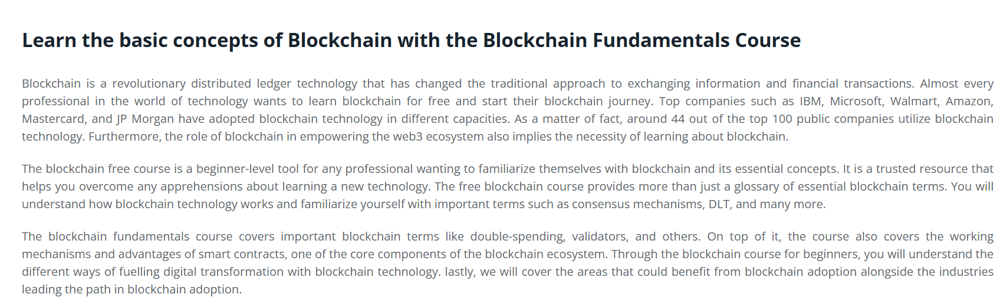
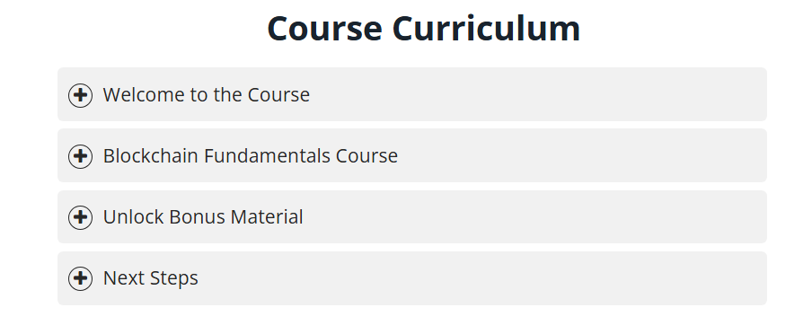
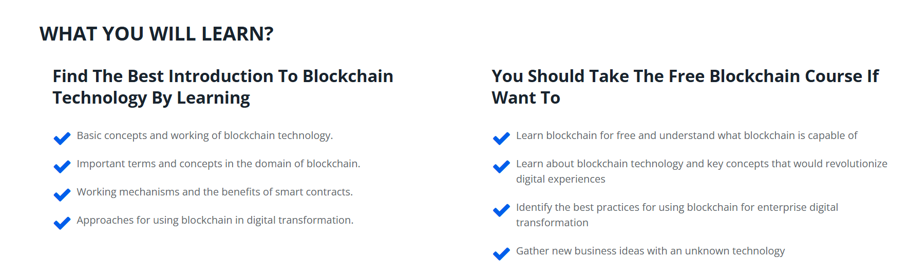

# 🧠 Blockchain Fundamentals – 101 Blockchains

This repository contains **notes, labs, research materials, references, and certificate of completion** for the *Blockchain Fundamentals – 101 Blockchains* program.  
The course provides a comprehensive introduction to **blockchain technology, consensus mechanisms, cryptography, smart contracts, and real-world applications**.

---

## 📚 Notes
- 📘 [01-introduction-blockchain.md](./notes/01-introduction-blockchain.md) – Overview of blockchain technology  
- 🔐 [02-cryptography-basics.md](./notes/02-cryptography-basics.md) – Key cryptographic principles in blockchain  
- ⚙️ [03-consensus-mechanisms.md](./notes/03-consensus-mechanisms.md) – PoW, PoS, and hybrid models  
- 🧩 [04-data-structures-ledgers.md](./notes/04-data-structures-ledgers.md) – Blocks, Merkle trees, and distributed ledgers  
- 🤖 [05-smart-contracts.md](./notes/05-smart-contracts.md) – Understanding and deploying smart contracts  
- 💰 [06-tokens-and-standards.md](./notes/06-tokens-and-standards.md) – ERC tokens and digital assets  
- 🔑 [07-wallets-and-key-management.md](./notes/07-wallets-and-key-management.md) – Wallet types, key handling, and security  
- 🌐 [08-networking-and-p2p.md](./notes/08-networking-and-p2p.md) – Blockchain networking, nodes, and communication  
- 🕵️‍♂️ [10-privacy-on-chain.md](./notes/10-privacy-on-chain.md) – On-chain privacy and anonymity techniques  

---

## 🧪 Labs
- 🧱 [hands-on-exercises.md](./labs/hands-on-exercises.md) – Practical blockchain exercises  
- 🧑‍💻 [red-team-labs.md](./labs/red-team-labs.md) – Attack surface exploration in blockchain  
- 🛡️ [blue-team-defense.md](./labs/blue-team-defense.md) – Defensive monitoring and risk mitigation  

---

## 🔬 Research
- 🧭 [research-overview.md](./research/research-overview.md) – Overview of blockchain research directions  
- 📑 [literature-review.md](./research/literature-review.md) – Review of academic papers  
- 🧪 [experimental-analysis.md](./research/experimental-analysis.md) – Technical experiment notes  
- 🧬 [research-methodology.md](./research/research-methodology.md) – Applied research methodology  
- 📜 [whitepaper-analysis.md](./research/whitepaper-analysis.md) – Analysis of major blockchain whitepapers  

---

## 📖 Docs
- 📘 [index.md](./docs/index.md) – Course index and structure  
- 📘 [roadmap.md](./docs/roadmap.md) – Blockchain learning roadmap  
- 📘 [syllabus.md](./docs/syllabus.md) – Official course syllabus  
- 📘 [glossary.md](./docs/glossary.md) – Common blockchain terms  
- 📘 [references.md](./docs/references.md) – External references and reading list  

---

## 🧩 Extras
- 🗂️ [case-studies.md](./extras/case-studies.md) – Real-world blockchain implementations  
- 🧰 [resources.md](./extras/resources.md) – Developer and learner resources  
- 🕰️ [timeline.md](./extras/timeline.md) – Blockchain history and evolution  

---

## 📸 Screenshots

| Section | Screenshot |
|--------------------------|------------|
| 🧭 Course Overview |  |
| 📘 Course Curriculum |  |
| 🎓 What You Will Learn |  |

---

## 📜 Certificate
🎓 [Blockchain Fundamentals – 101 Blockchains](./cert/Nguyen%20Vu%20Thanh%20Danh%20-%202025-10-25.pdf)

---

## 📝 Personal Review
This program offered a **solid foundation in blockchain technology**, covering its **architecture, security models, and real-world applications**.  
Through structured learning and practical labs, I developed a deeper understanding of **cryptographic integrity, consensus, and smart contract mechanics**.  
Highly recommended for anyone beginning their **journey in blockchain and Web3 security**.

---

## ✍️ Author
**Thành Danh** – Red Team Learner & Security Researcher  

- GitHub: [@ngvuthdanhh](https://github.com/ngvuthdanhh)  
- Email: ngvu.thdanh@gmail.com  

---

## 📄 License
This project is licensed under the **MIT License**.  
See [LICENSE](./LICENSE) for more details.  
© 2025 ngvuthdanhh. All rights reserved.
